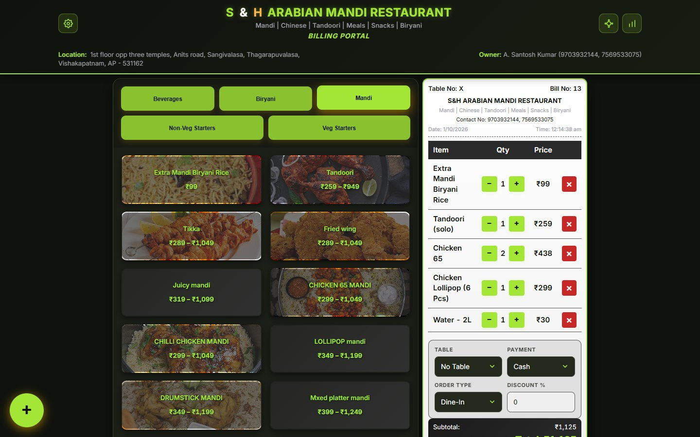
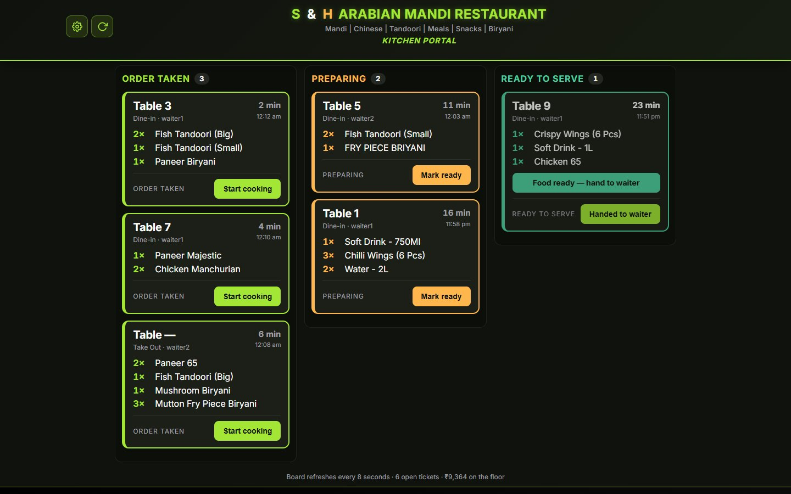
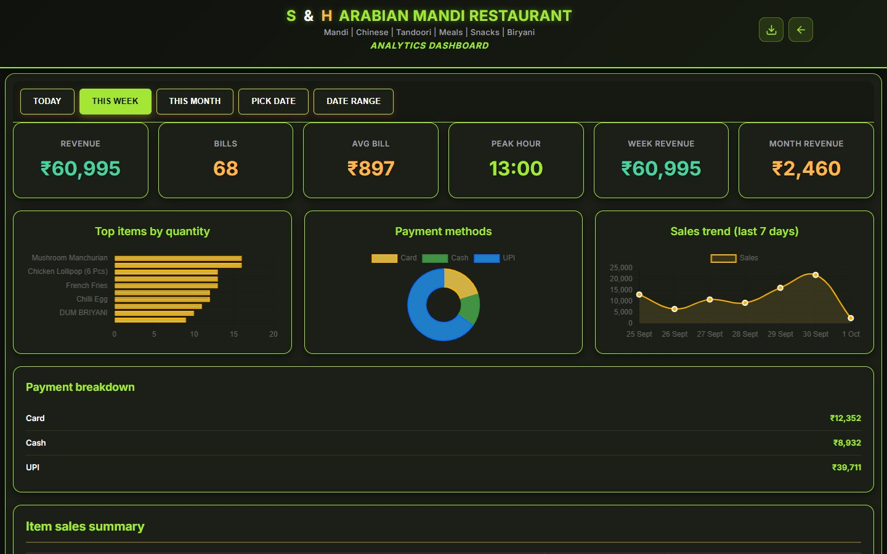
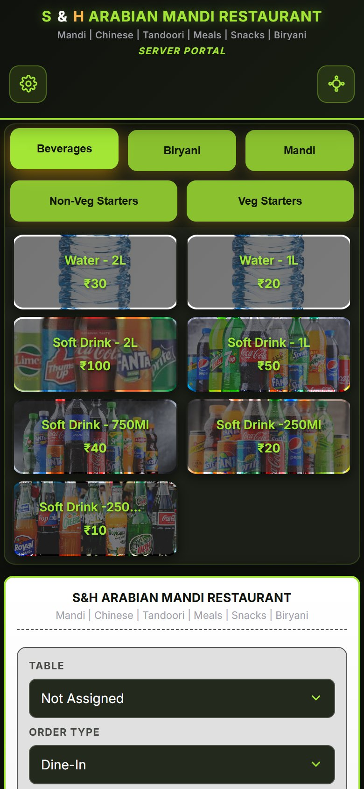
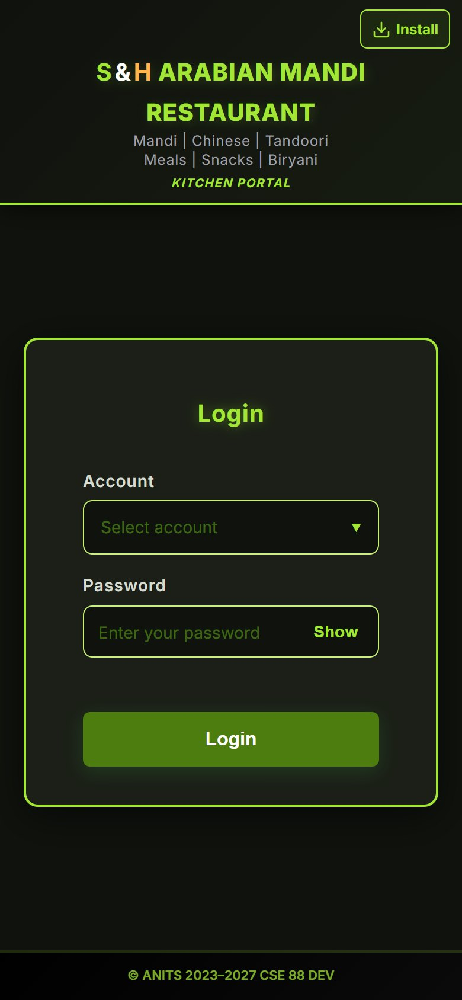
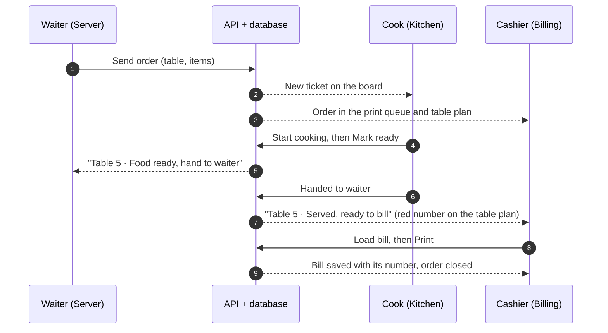

<div align="center">


# S&H Arabian Mandi Restaurant — POS

**Billing, waiter and kitchen screens for one restaurant, working together live.**

Mandi · Chinese · Tandoori · Meals · Snacks · Biryani — Sangivalasa, Visakhapatnam




</div>

---

## Contents

- [What it is](#what-it-is)
- [Screenshots](#screenshots)
- [Features](#features)
- [How an order flows](#how-an-order-flows)
- [Tech stack](#tech-stack)
- [Run it on your computer](#run-it-on-your-computer)
- [Configuration](#configuration)
- [Deploy to Vercel](#deploy-to-vercel)
- [Staff accounts and passwords](#staff-accounts-and-passwords)
- [Printer setup (once per counter PC)](#printer-setup-once-per-counter-pc)
- [Your data: bills, reports and deletion](#your-data-bills-reports-and-deletion)
- [Troubleshooting](#troubleshooting)
- [For developers](#for-developers)
- [Credits](#credits)

---

## What it is

A point-of-sale system made of **three portals** that share one API and one
database. Each portal can run on its own device — a counter PC, the waiters'
phones, a kitchen tablet — on any network.

| Portal | Address | Who signs in | What it is for |
|---|---|---|---|
| **Billing** | `/billing` | admin, cashier | Make the bill, print it, take payment |
| **Server** | `/server` | waiters | Take an order at the table and send it |
| **Kitchen** | `/kitchen` | cooks | Live order board: new → preparing → ready → served |
| **Analytics** | `/billing/analytics` | admin | Sales, charts, bill register, Excel report |

Each portal opens at its own login page, e.g. `/kitchen/login`.

## Screenshots

<table>
  <tr>
    <td colspan="2"><br><sub><b>Kitchen board</b> — each order is a ticket that moves across the columns.</sub></td>
  </tr>
  <tr>
    <td colspan="2"><br><sub><b>Analytics</b> — revenue, top items, payment methods and the 7-day trend.</sub></td>
  </tr>
  <tr>
    <td align="center" width="50%"><br><sub><b>Waiter's phone</b></sub></td>
    <td align="center" width="50%"><br><sub><b>Login</b>, with <i>Install</i> to add the portal as an app</sub></td>
  </tr>
</table>

<sub>Screens shown with sample orders and bills.</sub>

## Features

### Billing counter

- **Fast billing** — tap menu items (sizes such as solo / duo / trio / squad
  where an item has them), set quantities, table, payment (Cash, Card, UPI,
  Zomato, Swiggy, Pending), order type and a discount %. The **＋** button adds
  a one-off item.
- **Printed bill and token slip** for an **80 mm thermal printer** (e.g. TVS
  RP3200 Lite): bill number, date and time, items, totals and *"Thank you! 🙏
  Visit again 🙏"*, then the customer's token slip (items only) on its own page,
  so the cutter separates them. Set the printer up once — see
  [Printer setup](#printer-setup-once-per-counter-pc).
- **Table plan** — every table and its orders at a glance. A **red number** on
  the icon counts tables that have been served but not billed yet. From a table:
  **Load bill**, **Add items**, or delete an order.
- **Print queue** — orders the waiters sent, ready to load onto a bill.
- **Billed exactly once** — a bill closes exactly the orders it was made from.
  If two counters bill the same order at the same moment, the second is told it
  was already billed.
- **Menu and categories** (admin) — add, edit and delete items and categories
  from the gear menu; the dialogs stay open for several changes in a row.

### Waiters (Server portal)

- Pick a table, tap items, **Send order** — it appears on the kitchen board and
  at the counter straight away.
- Notices when food is ready to take to the table.

### Kitchen

- Orders arrive as tickets in three columns: **Order taken → Preparing →
  Ready to serve**, with one big button to move each along.
- Every ticket shows how long it has been waiting; after **20 minutes** the time
  is highlighted.
- The board refreshes by itself every 8 seconds (and on the refresh button).

### Analytics (admin)

- Today / this week / this month / any date or range: revenue, number of bills,
  average bill, busiest hour, top items, payment methods and a 7-day trend.
- **Bill register** with search, and **Manage bill → Print bill** (reprint any
  saved bill) or **Permanently delete bills**.
- **Excel sales report** for any date range — six sheets: Summary, Daily Sales,
  Payment Methods, Order Types, Item Sales and the full Bill Register, in a
  plain printable ledger style.

### Every portal

- **Works on phones, tablets and computers** (from small phones to large
  counter screens).
- **Install as an app** — each login page has an *Install* button that installs
  *that portal only*, with the restaurant logo. It disappears once installed.
- **Full screen** (Server and Kitchen, gear menu) — hides the browser bars.
  Not offered on iPhones, which only allow full screen for videos.
- **Dark and light theme** (gear menu → Theme).
- **One sign-in per portal** — Billing, Server and Kitchen can all be signed in
  on the same device without logging each other out.

## How an order flows



- Every **Send order** is its own ticket, so a table's second round cooks and
  clears on its own.
- Everything lives in the database, so every screen shows the same state and a
  refresh loses nothing.
- Screens ask for news only while they are on show (kitchen every 8 s, table
  list and notices every 10 s) and catch up the moment they are opened again.
- Notices disappear from screens after 30 minutes and are deleted after 6 hours.

## Tech stack

| Part | Built with |
|---|---|
| Web app | React 19, React Router 7, Vite 8, Chart.js 4, Axios; Inter font bundled |
| API | Python 3.12+, Flask 3, Flask-JWT-Extended (sign-in tokens), Flask-CORS, bcrypt |
| Database | MongoDB Atlas (PyMongo) |
| Reports | openpyxl (Excel) |
| Hosting | Vercel — pages plus the API as a Python function, daily cron |
| Installable apps | Web app manifests per portal + a small service worker |

## Run it on your computer

**You need:** Node.js 20.19+ (or 22.12+), Python 3.12+, and a MongoDB Atlas
database.

1. **Install**

   ```bash
   pip install -r requirements.txt
   npm install
   ```

2. **Settings** — copy `.env.example` to `.env` and fill in at least
   `MONGO_URI` and `JWT_SECRET_KEY` (see [Configuration](#configuration)).
   `.env` holds secrets and is never uploaded.

3. **Passwords** — the staff accounts are created on first start without a
   password. Give each one a password
   ([how](#staff-accounts-and-passwords)).

4. **Start** — two terminals:

   ```bash
   python app.py        # API on http://localhost:5000
   ```

   ```bash
   npm run dev          # web app on http://localhost:5173
   ```

   Open <http://localhost:5173/billing/login>. The web app passes `/api` on to
   the API, so everything runs from one address.

To keep both running in the background with logs (Git Bash / Linux):

```bash
nohup python app.py > logs/api.log 2>&1 &
nohup npx vite > logs/web.log 2>&1 &
```

They do not start again by themselves after the computer restarts.

## Configuration

API settings come from `.env` locally, or from the host's environment
variables (see `.env.example`):

| Variable | Default | What it does |
|---|---|---|
| `MONGO_URI` | *(required)* | MongoDB connection string |
| `MONGO_DB_NAME` | `sharabian_mandi_pos` | Database name |
| `JWT_SECRET_KEY` | *(random each start)* | **Set it** — otherwise every restart signs all staff out |
| `JWT_EXPIRY_DAYS` | `30` | How long a sign-in lasts |
| `BILL_RETENTION_ENABLED` | `false` | `true` deletes bills older than `BILL_RETENTION_DAYS` — see [below](#six-month-bill-deletion) |
| `BILL_RETENTION_DAYS` | `180` | Age at which a bill is deleted |
| `CRON_SECRET` | *(none)* | Vercel only: lets Vercel's daily cron run the deletion |
| `TZ_OFFSET_MINUTES` | `330` | Restaurant time zone (IST); decides "today" and the daily bill-number reset |
| `CORS_ORIGINS` | `*` | Only when the API runs at a different address from the pages |
| `DEBUG` | `false` | Developer's computer only — never on the internet |
| `PORT` / `HOST` | `5000` / `0.0.0.0` | Where `python app.py` listens |
| `MAX_UPLOAD_MB` | `8` | Largest request the API accepts |

Read when the web pages are built:

| Variable | When to set it |
|---|---|
| `VITE_API_URL` | Only if the API runs at a different address from the pages |
| `SITE_URL` | Only with your own domain (for link previews); Vercel knows its own address |

## Deploy to Vercel

The pages **and** the API run in one Vercel project at one https address.
`vercel.json` already sets everything up: the build, `/api/…` → the Python
function in `api/index.py`, the Mumbai region (next to the database) and the
daily cron.

1. **Put the project on GitHub.** `.gitignore` keeps `.env`, `backups/`,
   `logs/` and `node_modules/` out. Keep the repository **private**.
2. **Import the repository in Vercel.** No build settings to change.
3. **Environment variables** (Vercel → Settings → Environment Variables), for
   **Production**, type **Secret**:

   | Key | Value |
   |---|---|
   | `MONGO_URI` | from `.env` |
   | `JWT_SECRET_KEY` | from `.env` |
   | `CRON_SECRET` | from `.env` |
   | `BILL_RETENTION_ENABLED` | `true` |

   Do **not** add `VITE_API_URL` or `CORS_ORIGINS`. Keep *Enable access to
   System Environment Variables* ticked.
4. **MongoDB Atlas → Network Access:** allow `0.0.0.0/0`. Vercel has no fixed
   address, so a strong database password is what protects the data.
5. **Deploy**, then open `https://<your-project>.vercel.app/api/health`. It
   should say `"database": "connected"`.

**Updating the live site:** upload the changed files to GitHub; Vercel rebuilds
by itself in about two minutes. Installed apps pick up the new version the next
time they are opened.

**Good to know**

- Vercel's free plan is for personal, non-commercial use; a business is
  expected to use **Pro**.
- After a quiet spell the first request takes 1–3 seconds longer while Vercel
  wakes the API up.
- With all three portals open the screens make about 25 requests a minute.

## Staff accounts and passwords

| Role | Accounts | Can use |
|---|---|---|
| admin | 1 | Billing, Analytics, menu and categories, deleting bills |
| cashier | 1 | Billing: bills, table plan, print queue |
| waiter | 3 | Server portal |
| cook | 2 | Kitchen portal |

The login pages list the accounts; they are defined in
`src/config/portals.js` and created by `server/bootstrap.py`.

**Passwords live only in the database**, scrambled with bcrypt — never in the
code or in `.env`. To set or change one (the typed password is not shown):

```bash
python -m server.passwords set <account email>
```

`python -m server.passwords list` shows every account and whether it has a
password (never the password itself).

- Every API call checks the role: waiters cannot bill or delete, cooks only move
  tickets, only the admin manages the menu and deletes bills.
- There is no limit on wrong password attempts, so use **strong passwords** on
  the live site.

## Printer setup (once per counter PC)

The bill prints from the browser, so the **print dialog and the printer's own
settings** decide the paper. Set them once; Chrome and Edge remember them for
that printer.

1. **In the print dialog** (press *Print* on a bill), choose the thermal
   printer, open **More settings** and set:
   - **Paper size:** the printer's 80 mm receipt / roll size
   - **Margins:** None
   - **Scale:** Default
   - **Headers and footers:** off (unticked)
2. **If blank paper still comes out after each slip**, open Windows **Settings
   → Bluetooth & devices → Printers & scanners → *your printer* → Printing
   preferences**, choose the same 80 mm receipt size there, and switch on the
   driver's option that stops at the end of the printed lines (names differ:
   *paper saving*, *reduce blank space*, *feed/cut at end of page*). Set the
   cutter to cut **after each page**, so the bill and the token slip come out
   separately.
3. Optional, for one-tap printing without the dialog: start Chrome on the
   counter PC with the `--kiosk-printing` option (add it to the end of the
   Chrome shortcut's *Target*); it then prints straight to the default printer
   with those settings.

The print preview always shows the whole paper; whether the blank part is fed
depends on step 2.

## Your data: bills, reports and deletion

### Bill numbers

Bill numbers start again at **1 every day** (restaurant time) and are handed
out one at a time, so two counters never get the same number. Because numbers
repeat from day to day, a bill is always opened by its date and number
together.

### Six-month bill deletion

With `BILL_RETENTION_ENABLED=true`, bills older than **180 days** are erased
from the database for good (not hidden).

- **On Vercel:** once a day at about 03:00 IST (Vercel cron →
  `/api/cron/retention`, which only answers Vercel's own call).
- **On a computer or ordinary server:** when the API starts and every 6 hours.

**Download each month's Excel report and keep it** — deleted bills cannot be
brought back, and sales records usually have to be kept for years.

### Excel report

Analytics → download → pick the dates. Six sheets: Summary, Daily Sales,
Payment Methods, Order Types, Item Sales and the full Bill Register — Times New
Roman, black only, a border on every cell, A4 with page numbers.

### Backups and logs (on the computer only, never uploaded)

- `backups/` — copies of records removed during clean-ups and the first
  six-month deletion.
- `logs/` — `api.log` and `web.log` when the servers run in the background;
  deleted orders and bills are recorded there.

## Troubleshooting

| Problem | What to do |
|---|---|
| *Database unavailable* / health check says disconnected | Check `MONGO_URI`; in Atlas → Network Access allow your address (or `0.0.0.0/0` for Vercel) |
| Everyone was signed out after a restart | Set a fixed `JWT_SECRET_KEY` |
| Changes don't show on the live site | Check Vercel → Deployments for the new build; close and reopen installed apps |
| No *Install* button | The portal is already installed on this device. On iPhone use Share → *Add to Home Screen* |
| No *Full screen* on iPhone | Apple only allows full screen for videos |
| First screen is slow after a quiet spell | Vercel is waking the API up (1–3 s) |
| *"This order has already been billed on another counter"* | It was — another counter printed it first |
| Bill prints with big gaps, the date or the web address | Do the [printer setup](#printer-setup-once-per-counter-pc) once on that PC |
| Local app doesn't open after a restart | Start `python app.py` and `npm run dev` again |

## For developers

<details>
<summary><b>Project structure</b></summary>

```
app.py                     start the API on a computer (python app.py)
api/index.py               the same API as one Vercel function
vercel.json                Vercel: build, /api routing, Mumbai region, daily cron, caching
index.html                 page shell: title, description, link-preview tags, theme script
requirements.txt           Python packages      package.json   Node packages

server/                    Flask API
  __init__.py              create_app(): settings, CORS, sign-in tokens, routes
  config.py                every setting, read from the environment / .env
  db.py                    MongoDB connection, collections, indexes
  api.py                   response format and @roles_required
  bootstrap.py             staff accounts and default categories on start
  passwords.py             command line: set staff passwords
  security.py              bcrypt password hashing
  validation.py            bill checks; totals are recomputed on the server
  retention.py             six-month bill deletion
  reports.py               the Excel workbook
  notifications.py         kitchen notices
  timeutil.py              UTC storage, restaurant "today"
  routes/                  auth, bills, menu, orders, print_queue, reports, notifications, system

src/                       React web app
  main.jsx, App.jsx        start-up and the three portal routes
  api/                     client.js (Axios + sign-in), session.js (one sign-in per portal), index.js (every API call)
  config/                  brand.js (name, address, contact), portals.js, constants.js
  styles/                  index.css (colours, layout, print), components.css, theme.js, typography.js
  hooks/                   useMenu, useCart, usePolling, usePageTitle
  components/              auth/, layout/, ui/, notifications/, menu/, modals/, receipt/, settings/
  pages/                   billing/ (+ analytics/), server/, kitchen/
  utils/                   format, install, fullscreen, zoom, sizes, download

public/                    icons, favicon, robots.txt, per-portal manifests, service worker
brand/logo-original.jpg    the logo the icons are made from (scripts/make_app_icons.py)
docs/screenshots/          images used in this README
tests/                     smoke_test.py (whole order flow), retention_test.py (deletion rule)
```

</details>

<details>
<summary><b>API reference</b></summary>

All responses are JSON: `{ "success": true, … }` or
`{ "success": false, "error": "…" }`. Signed-in calls send
`Authorization: Bearer <token>` from `POST /api/auth/login`.

| Method | Path | Who |
|---|---|---|
| POST | `/api/auth/login` | anyone |
| GET / POST | `/api/auth/verify`, `/api/auth/logout` | signed in |
| GET | `/api/custom-items`, `/api/categories` | all staff |
| POST | `/api/custom-items` | admin, cashier |
| PUT / DELETE | `/api/custom-items/<name>` | admin |
| POST / DELETE | `/api/categories`, `/api/categories/<name>` (deletes its items too) | admin |
| GET | `/api/active-tables` | all staff |
| POST | `/api/active-tables` (send an order) | waiter, cashier, admin |
| PATCH | `/api/active-tables/<id>/status` | cook, cashier, admin |
| DELETE | `/api/active-tables/<id>` | cashier, admin |
| PATCH | `/api/active-tables/table/<number>/close-table` | waiter, cashier, admin |
| POST | `/api/print-queue` | waiter, cashier, admin |
| GET / DELETE | `/api/print-queue`, `/api/print-queue/<id>` | admin, cashier |
| GET | `/api/bill-number` (next number, not used up) | anyone |
| POST | `/api/bill` (save a bill) | admin, cashier |
| GET | `/api/bills`, `/api/bill/<id>` | admin, cashier |
| DELETE | `/api/bill/<id>/permanent-delete` | admin |
| GET | `/api/reports/sales.xlsx?from=YYYY-MM-DD&to=YYYY-MM-DD` | admin |
| GET / POST | `/api/notifications`, `/api/notifications/seen` | all staff |
| GET | `/api/health` | anyone |
| GET | `/api/cron/retention` | Vercel cron (`CRON_SECRET`) |

</details>

<details>
<summary><b>Conventions</b></summary>

- **Every API call goes through `src/api/index.js`** — components never build
  URLs.
- **The server owns the money** — subtotals, discounts and totals are
  recalculated from the items when a bill is saved.
- **Bills are addressed by `id`**, never by bill number (numbers restart daily).
- **Times are stored in UTC**; "today" is the restaurant's day.
- **No `alert()`, `confirm()` or native `<select>`** — messages use
  `useNotify()`, dropdowns use `Select` / `MenuPopup`.
- **Names are written once** — `src/config/brand.js` and
  `src/config/portals.js` (the Excel report keeps its own copy of the name).
- **Nothing secret in the code** — passwords only in the database, keys only in
  `.env` / the host.
- **Colours are CSS variables** (dark on `:root`, light on
  `html[data-theme='light']`).
- **Popups are drawn above the page and kept on screen** (`MenuPopup`); the
  desktop layout uses `body { zoom }`, so hand-positioned things go through
  `utils/zoom.js`.
- The portals are staff tools and **kept out of search engines** on purpose
  (`noindex`, `robots.txt`); link previews still work.

</details>

<details>
<summary><b>Testing</b></summary>

```bash
npm run lint && npm run build
```

```bash
python tests/retention_test.py
```

Checks the six-month deletion rule on a throwaway collection, then reports
(read-only) what the live setting would do.

The smoke test walks the whole flow — sign-in, roles, menu, sending an order,
the kitchen, notices, print queue, billing, the Excel report. It saves real
bills, so run it against a **separate test database**, never the shop's:

1. Start a second API on a test database:
   `MONGO_DB_NAME=pos_smoketest PORT=5055 python app.py`
   (copy `custom_items` and `categories` into it for the menu checks).
2. Set passwords there for the admin, a waiter and a cook with
   `python -m server.passwords set …` (same `MONGO_DB_NAME`).
3. Run it, then delete the test database:

```bash
SMOKE_BASE_URL=http://localhost:5055 SMOKE_ADMIN_PASSWORD=… SMOKE_STAFF_PASSWORD=… python tests/smoke_test.py
```

</details>

The full history of changes, fixes and decisions is in
[PROJECT_LOG.md](PROJECT_LOG.md).

## Credits

Built for **S&H Arabian Mandi Restaurant**, Sangivalasa, Visakhapatnam.

© ANITS 2023–2027 CSE 88 DEV
